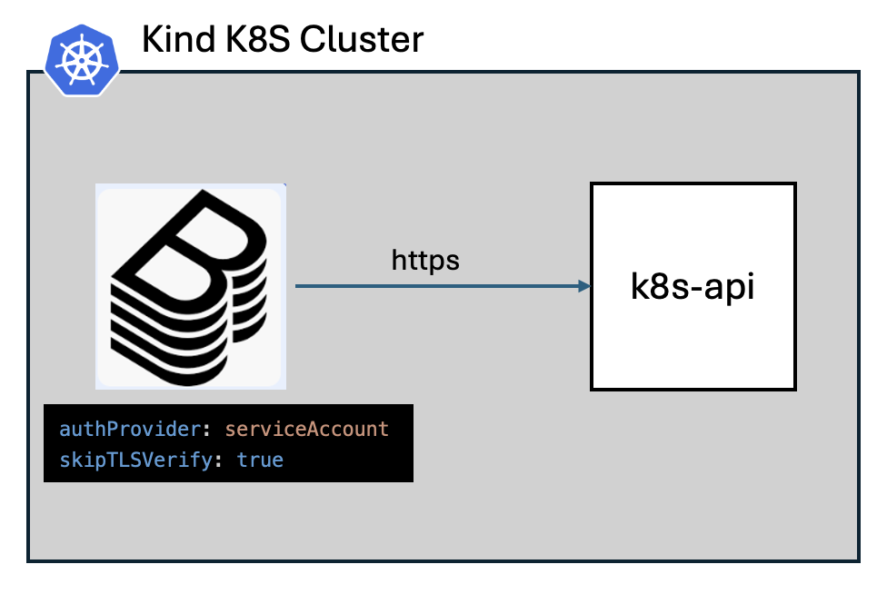
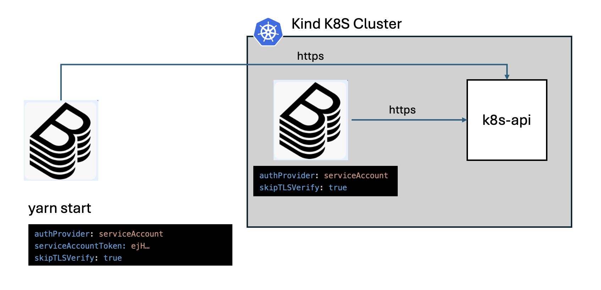

# Kubernetes Integration with Backstage

Backstage uses the core Kubernetes plugin to integrate with Kubernetes cluster. The authentication and authorization will depend on the provider used.

This document addresses the use case when Backstage integrates in the same k8s clusted where it is deployed. Other advanced use cases with AWS EKS and IAM should be addressed later.

## Integrate with local Kubernetes cluster

### Backstage runs in the k8s cluster

This is the most frequent use case where Backstage integrates with the k8s cluster in which it is deployed. 


#### Authentication

Backsage uses k8s ServiceAccount, used by the Backstage Pods, provider to authenticate with the k8s API server.

#### Authorization

Additional [RBAC privilieges](https://github.com/altimetrik-digital-enablement-demo-hub/dep-backstage/tree/main/deploy/kustomize/backstage/base/sa-k8s-rbac,yaml) are required for the Backstage k8s ServiceAccount to allow Backstage to watch k8s resources across the cluster.

Example:

```yaml
kubernetes:
  frontend:
    podDelete:
      enabled: true
  serviceLocatorMethod:
    type: 'multiTenant' # Or 'singleTenant' if you have a single cluster
  clusterLocatorMethods:
    - type: 'config'
      clusters:
        - url: http://kubernetes.default.svc
          name: backstage
          authProvider: serviceAccount
          skipTLSVerify: true
```

### Backstage runs out of the k8s cluster

In this use case Backstage runs out of k8s cluster and this is the case with the Backstage local dev environment.



If k8s integration is desired, to test k8s features, it is possible to integrate Backstage with a k8s cluster using k8s ServiceAccount provider and a token geneated for it. The easiest way to do this is to run Backstage [Dev Kind cluster](./kind-development.md).

All that is needed is the Backstage k8s ServiceAccount token

```sh
> kubectl -n dev-backstage get secret backstage-sa-token -o go-template='{{.data.token | base64decode}}
eyJhbGciOi...
```
